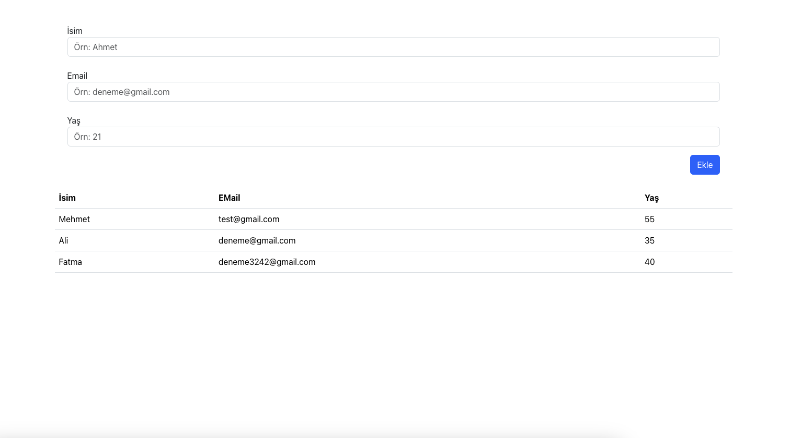

# Unit Test vite ile kullanımı

- gerekli kütüphaneler

1. @testing-library/jest-dom
2. @testing-library/react
3. @testing-library/user-event
4. jsdom
5. vitest

# test yazma süreci 
1. Test Driven Development (red to green test)
- önce testler yazılır daha sonra teste sadık kalınarak özellik geliştirilir.
testleri yazmak yük gibi gelmez

2. Behavior Driven Development 

- önce özellik kodlarınr daha sonra bu özellik için gerekli test yazılır

